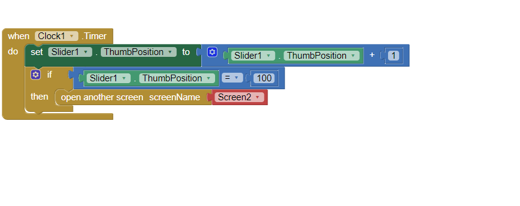
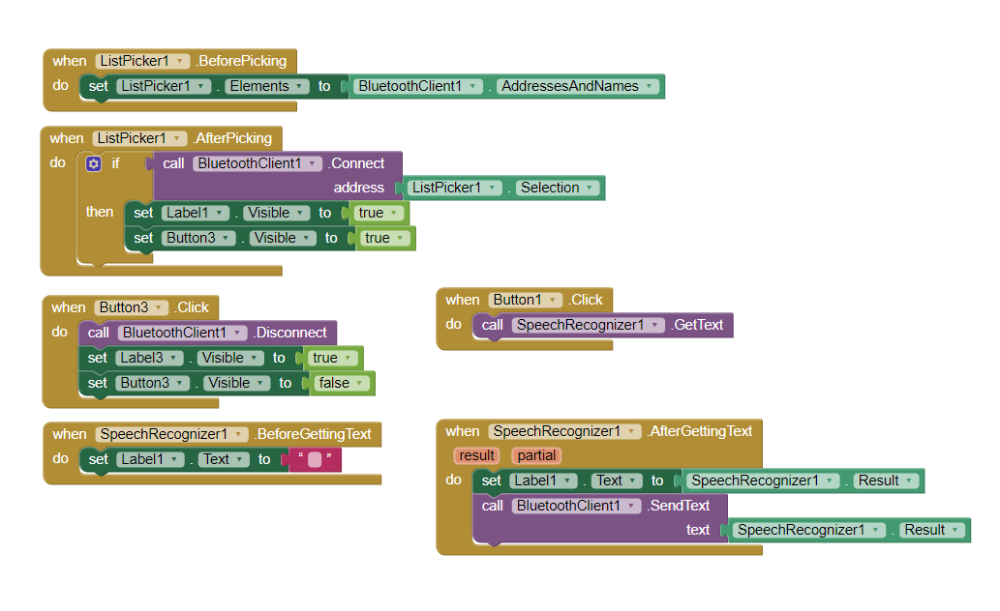

# Sistem Kendali Lampu Rumah Prototype

Pada Projek ini dibuat sebuah sistem pengendali lampu LED untuk prototype rumah dengan menggunakan input suara melalui aplikasi Android. Perangkat yang dibuat akan disambungkan dengan modul Bluetooth sehingga dapat terhubung dengan aplikasi Android. Setelah itu, pada smartphone dapat melakukan input suara untuk mengendalikan nyala mati lampu LED.

Aplikasi Android dibangun menggunakan aplikasi MIT APP Inventor yang dapat membuat sebuah aplikasi Android dengan mudah. Berikut adalah gambar kode blok yang digunakan untuk membangun aplikasi. 

### Alat Yang Dibutuhkan
- Arduino Uno
- Modul Bluetooth HC05
- 2x Lampu LED
- Breadboard
- Kabel Jumper
- Prototype Rumah 
